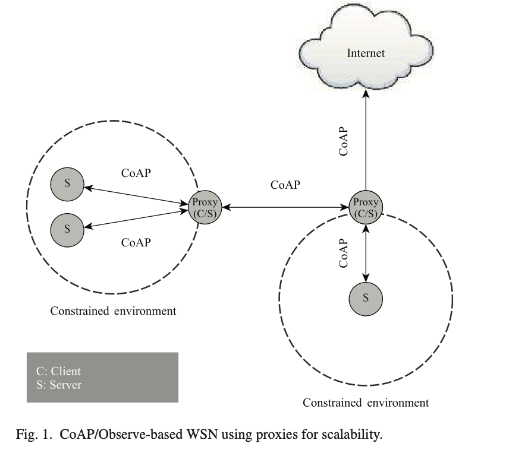

# Dynamic Aggregation and Scheduling in CoAP/Observe-Based Wireless Sensor Networks

---
## The IoT revolution 

The possibility of organizing an high number of sensors inside a network led to the opening of new perspectives among different fields (manifacturing, smart metering, e-health etc.).

---

### Enabling technologies 
The innovation has been made possible by several key technologies:
- Cloud computing
- 6LoWPAN
- Protocols for constrained networks
[fig.1]

---

## Constrained Application Protocol
CoAP has been designed for constrained networks. 
- Built on top of UDP
- Reduced message overhead
- Based on REST architecture
- Less resource usage compared to HTTP

---

### CoAP/Observe
An extension that allow to introduce a publish/subscribe mechanism, giving the possibility of observe resource changes to the clients. 
- No polling to the servers
- Notifications on resource changes

---

### Observing resources
Observers must register separately to each subject of a CoAP server. 
The notifications may be:
- periodic (NON)
- threshold based (CON)

---

### Observing resources - Multiple registration steps

---

### Observing resources - Optimization issues
- Energy
- Consistency
- Registrations and caching

Congestion control: 
- No more than one NON notification per RTT
- Wait for ack of a single CON
---

## Definitions - Nodes 
- $N$: The set of WSN **Nodes**
- $N^S\subset N$: The set of **sources**
- $N^D\subset N$: The set of **destinations**
In a M2M $N^D$ will include each WSN node, in a monitoring application will contain the edge routers (connected to the Internet) only
---
## Definitions - Transmission plan
A node can have a transmission plan, containing a set of observation requests.
- $p^k_{n_i}$: The k-th transmission plan at node $n_i$ 

The period, after all plan's data have been received, during which plan's data will be transmitted is defined **Transmission Window** of a plan.

---

## Definitions - Transmission plan window
Given the plan at node $n_i$ denoted $p^k_{n_i}$
- $W^L(p^k_{n_i}) \geq 0$: **Lower bound**
- $W^H(p^k_{n_i}) \geq 0$: **Upper bound**
- $T^{min}$: time that 1B takes to be transmitted

$W^L(p^k_{n_i})$ is the moment when all notifications are available

$W^H(p^k_{n_i})$ is the moment when all notifications have been sent out

---

## Definitions - Aggregation and scheduling
When an observation request arrives:
- Choose the the subject server (and intermediate proxies)
- Determine the registrations to do
In order to guarantee the notification delivery in an optimized way. 

---

## Problem formalization

$S(n)$ denotes the set of subjects that node $n \in N$ has in its namespace. 

---
## Problem formalization

$S(n)$ denotes the set of subjects that node $n \in N$ has in its namespace. 
While acting as a client/observer $n$ can have a set of observations 
$O(n)$.

---

## Problem formalization

$S(n)$ denotes the set of subjects that node $n \in N$ has in its namespace. 
While acting as a client/observer $n$ can have a set of observations 
$O(n)$.
Each $o \in O(n)$ has a source (server/proxy) denoted $srv(o)$ and a subject $sub(o)$

---

## Problem formalization
Also transmission plans have a set of observations $O(p^k_n)$
An $o \in O(p^k_n)$ besides $sub(o)$ and $srv(o)$ has a set of clients/destinations to which the notification must be sent $D(o)$

---

## Problem formalization - New request arrives
Assuming a request for observation $r$ has arrived.
$sub(r)$ is the subject to be observed. 
The subject is available at a set denoted:
$N^S = \{n \in N \setminus N^D:(sub(r) \in S(n))$ $\ \ \ \ \ \ \ \ \ \ \ \ \ \vee ( \exists o \in O(n):sub(r)=sub(o))\}$

$N^S$ includes the nodes having subject in their namespace and nodes having subject notifications in their cache

--- 

## Problem formalization - Shortest forwarding
When a new request $r$ comes we want to choose the shortest forwarding and highest saving of extra byte transmissions.

---

## Minimizing the costs

$\sum\limits_{n_i \in N \setminus N^D}  \sum\limits_{p^k_{n_i} \in P(n_i)} \sum\limits_{n_j \in N \setminus N^S : n_j \neq n_i} \sigma^{n_i,n_j}_{p^k_{n_i}} \times OWD^{n_i}_{n_j} \times[1 + \Delta (n_i, p^k_{n_i}, n_j, r)]$

$$
\sigma^{n_i,n_j}_{p^k_{n_i}} = \begin{cases}
 1,   \text{when a notification from $p^k_{n_i}$ flows into $n_j$ } \\
 0,   \text{otherwise}
\end{cases}
$$
$$
OWD^{n_i}_{n_j}: \text{one way delay from $n_i$ to $n_j$} 
\text{measured as } \ \frac{RTT}{2}
$$
---

## Minimizing the costs

$\sum\limits_{n_i \in N \setminus N^D}  \sum\limits_{p^k_{n_i} \in P(n_i)} \sum\limits_{n_j \in N \setminus N^S : n_j \neq n_i} \sigma^{n_i,n_j}_{p^k_{n_i}} \times OWD^{n_i}_{n_j} \times[1 + \Delta (n_i, p^k_{n_i}, n_j, r)]$
Weight function: 
$$
\begin{equation}
\Delta(n_i, p^k_{n_i}, n_j, r) = \max \{ \chi(p^k_{n_i}, n_j) \times \delta , 1 - \chi(p^k_{n_i}, n_j) \} \times (1 - b^{n_j}_{sub(r)})
\end{equation}
$$
$$
\begin{equation}
\chi(p^k_{n_i}, n_j) = \Biggl \lceil \frac{ | \{ o\in O(p^k_{n_i}) : n_j \in D(o) \}| }{|O( p^k_{n_i})|} \Biggr \rceil 

\end{equation}
$$
---