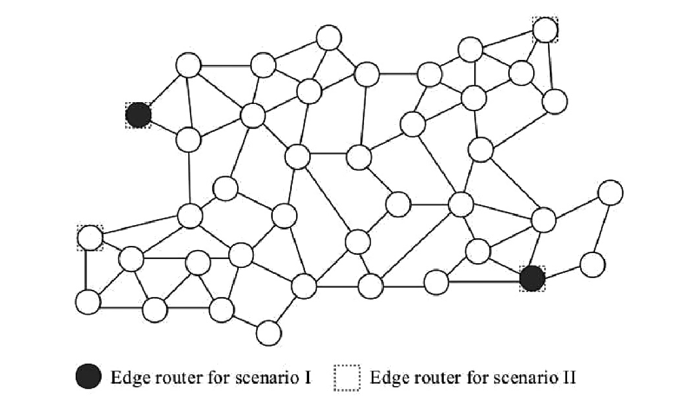
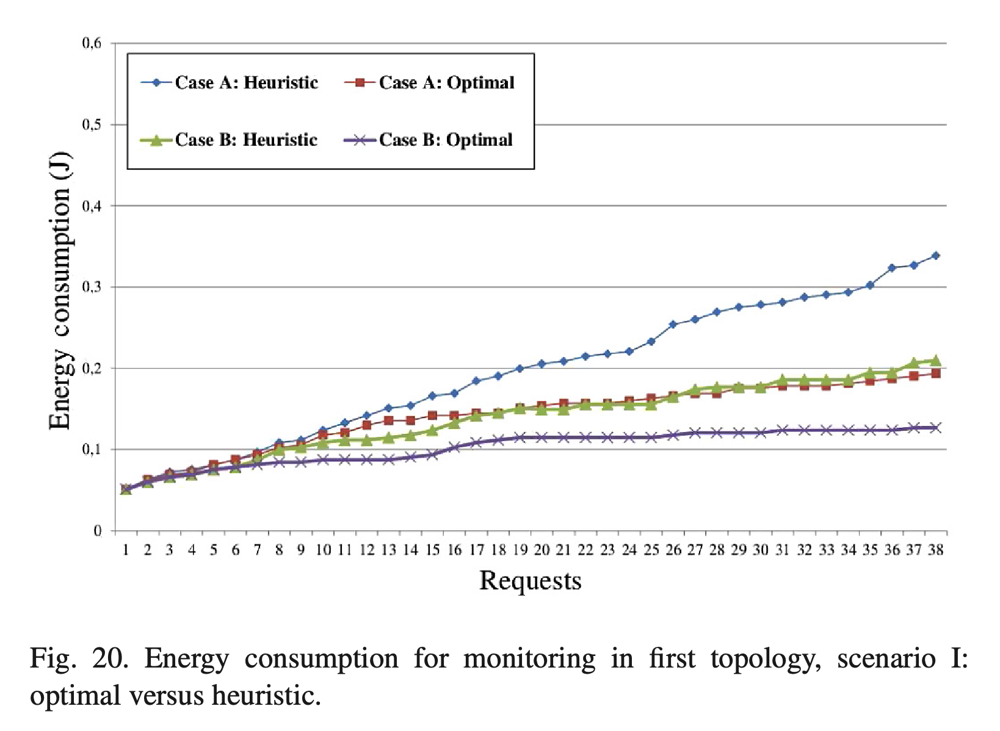

# Dynamic Aggregation and Scheduling in CoAP/Observe-Based Wireless Sensor Networks

---

## Overview 

- Context
- Problem
- Problem formalization
- Heuristic approach
- Results
- Conclusion

---
<!--
header: 'Context'
-->
### WSN

- High number of nodes
- Low resources
- Optimization issues
- Specific application protocols
---

## Constrained Application Protocol
CoAP has been designed for constrained networks. 
- Built on top of UDP
- Reduced message overhead
- Based on REST architecture
- Less resource usage compared to HTTP

---

### CoAP/Observe
An extension that allows to introduce a publish/subscribe mechanism. A client can observe resource changes.
- No polling to the servers
- Notifications on resource changes

---

### Observing resources
- Observer registration for each subject in a CoAP server
- Notifications may be periodic (NON) or threshold based (CON)
- Multiple registration steps in larger networks 

---

### Multiple registration steps

---
<!--
header: 'Problem'
-->
## Optimization issues

- Energy: Reduce the number of wakeups through aggregation/scheduling
- Consistency: Max-age constraints
- Registration and caching: Reduce server inquiries

---

<!--
header: 'Problem formalization'
-->
### Nodes sets

- $N$: The set of WSN **Nodes**
- $N^S\subset N$: The set of **sources**
- $N^D\subset N$: The set of **destinations**
In a M2M $N^D$ will include each WSN node, in a monitoring application will contain the edge routers (connected to the Internet) only

---
## Transmission plan
A node can have a transmission plan, containing a set of observation requests.
- $p^k_{n_i}$: The k-th transmission plan at node $n_i$ 

The period, after all plan's data have been received, during which plan's data will be transmitted is defined **Transmission Window** of a plan.

---
## Transmission Window 

Given the plan at node $n_i$ denoted $p^k_{n_i}$
- $W^L(p^k_{n_i}) \geq 0$: **Lower bound**
- $W^H(p^k_{n_i}) \geq 0$: **Upper bound**
- $T^{min}$: time that 1B takes to be transmitted

$W^L(p^k_{n_i})$ is the moment when all notifications are available

$W^H(p^k_{n_i})$ is the moment when all notifications have been sent out

---

## Namespace

- $S(n)$ denotes the set of subjects that node $n \in N$ has in its namespace. 

---

## Observations set
- While acting as a client/observer $n$ can have a set of observations 
$O(n)$.

- Each $o \in O(n)$ has a source (server/proxy) denoted $srv(o)$ and a subject $sub(o)$

---

## Observations set
Also transmission plans have a set of observations $O(p^k_n)$
An $o \in O(p^k_n)$ besides $sub(o)$ and $srv(o)$ has a set of clients/destinations to which the notification must be sent $D(o)$

---

## Sources set
Assuming a request for observation $r$ has arrived.
$sub(r)$ is the subject to be observed. 
The subject is available at a set denoted:
$N^S = \{n \in N \setminus N^D:(sub(r) \in S(n))$ $\ \ \ \ \ \ \ \ \ \ \ \ \ \vee ( \exists o \in O(n):sub(r)=sub(o))\}$

$N^S$ includes the nodes having subject in their namespace and nodes having subject notifications in their cache

--- 

## Variables

$$
\begin{align}
& \sigma^{n_i,n_j}_{p^k_{n_i}} = \begin{cases}
 1,   \text{when a notification from $p^k_{n_i}$ flows into $n_j$ } \\
 0,   \text{otherwise}
\end{cases} \\ \\

& b^n_s = \begin{cases}
 1,   \text{if s $\in$S(n) or  } \exists o \in O(n) : sub(o) = s  \\
 0,   \text{otherwise}
\end{cases} \\ \\

& OWD^{n_i}_{n_j}: \text{one way delay from $n_i$ to $n_j$ } 
\text{measured as } \ \frac{RTT}{2}

\end{align}
$$
 

---

## Constants

- $L$: average notification packet lenght in bytes

- $0  \lt \delta \lt 1$: Aggregation overload factor

- $G$: Network density parameter

---
## Aggregation function

$
\begin{equation}
\chi(p^k_{n_i}, n_j) = \Biggl \lceil \frac{ | \{ o\in O(p^k_{n_i}) : n_j \in D(o) \}| }{|O( p^k_{n_i})|} \Biggr \rceil 
\end{equation}
$

---

## Shortest forwarding
When a new request $r$ comes we want to choose the shortest forwarding and highest saving of extra byte transmissions.

---

## Minimizing the costs

$\sum\limits_{n_i \in N \setminus N^D}  \sum\limits_{p^k_{n_i} \in P(n_i)} \sum\limits_{n_j \in N \setminus N^S : n_j \neq n_i} \sigma^{n_i,n_j}_{p^k_{n_i}} \times OWD^{n_i}_{n_j} \times[1 + \Delta (n_i, p^k_{n_i}, n_j, r)]$

**Weight function:**

$
\begin{equation}
\Delta(n_i, p^k_{n_i}, n_j, r) = \max \{ \chi(p^k_{n_i}, n_j) \times \delta , 1 - \chi(p^k_{n_i}, n_j) \} \times (1 - b^{n_j}_{sub(r)})
\end{equation}
$

---

## Finding the Extra Load 
$
\kappa_{p^k_{n_i}} = \sum\limits_{n_j \in N \setminus N^S :n_i \neq n_j} \sigma^{n_i,n_j}_{p^k_{n_i}} \times OWD^{n_i}_{n_j} \times \Delta (n_i, p^k_{n_i}, n_j, r)
$
$
\\
\ \ \ \ \ \ \ \ \ \ \ \ \ \ \ \forall n_i \in N\setminus N^D; \ \ \  \forall p^k_{n_i} \in P(n_i)
$

---
## The new Transmission window

The new value of the transmission window will be constrained as follows:

$
\omega^{H}_{p^k_{n_i}} \geq [W^H(p^k_{n_i}) - W^L(p^k_{n_i})] + \kappa_{p^k_{n_i}} \times L \times T^{min}
$
$
\\
\ \ \ \ \ \ \ \ \ \ \ \ \ \ \ \forall n_i \in N\setminus N^D; \ \ \  \forall p^k_{n_i} \in P(n_i)
$

$
\omega^{L}_{p^k_{n_j}} \geq \max_{n_i, p^l_{n_i} \in P(n_i):\exists o \in O(p^l_{n_i})\wedge n_j \in D(o)}\{\omega^{H}_{p^l_{n_i}}\}
$

$
\\
\ \ \ \ \ \ \ \ \ \ \ \ \ \ \ \forall n_j \in N\setminus N^D; \ \ \  \forall p^k_{n_j} \in P(n_j)
$

---

## Max-age constraints

Confirming the max age for all ongoing notifications

$
\omega^{H}_{p^k_{srv(o)}} \times G \leq m(sub(o)) \ \  \forall n \in N; \ \ \forall o \in O(n);
$

$
\ \ \ \ \exists p^k_{srv(o)} \ \wedge o' \in O(p^k_{srv(o)}) : n \in D(o') 
$

Confirming the max age for new observations

$
\omega^{H}_{p^k_{n_i}} \times G \leq [m(sub(r)) - \Theta] + \Theta \ \  \forall n \in N; \ \ \forall o \in O(n);
$

$
\ \ \ \ \  \forall n_j \in N^D; \ \ \forall n_i \in N\setminus N^D; \ \forall p^k_{n_i} \in P(n_i)
$

---

## Number of wake ups for node
$
\begin{equation}
\lambda^{n_i} = \sum\limits_{p^k_{n_i} \in P(n_i)}
\Biggl \lceil \frac{|O( p^k_{n_i})| + \sum_{n_j \in N : n_j \neq n_i}\sigma^{n_i,n_j}_{p^k_{n_i}}}{\Theta} \Biggr \rceil 
\end{equation}
$

$
\ \ \ \ \forall n_i \in N \setminus N^D
$

$
\lambda^{n_i} \leq M
$

The wake ups are limited to $\ M$

---
<!--
header: 'Heuristic approach'
-->
# An heuristic approach
The previous formalization is hard to solve and becomes impratical when the WSN or the number of requests increase. 

Then is proposed a heuristic algorithm that must run for each possible destination $n_j \in N^D$

---
## The idea
When the algorithm runs the heuristic will search for the nearest to $n_j \in N^D$ admissible solution, increasing the neighborhood of search if necessary.

Where the neighborhood level $nb$ is the the number of hops (OWD) between $n_i$ and the solution under consideration.

---

### Neighborhood Level

---
## The algorithm

For an arriving observation request, condering a destination 
$n_j \in N^D$ the heuristic will first look at nodes in $nb=1,\text{then} \ nb=2 ...$ Until a solution is found or all the neighborhood level are searched.

---
## The algorithm

For a specific neighborhood level, two sets are processed in the following order.
$H^I$: Nodes with the resource and already sending notifications (from previous requests) to $n_j$. We can aggregate the notification, and the best soultion is the pair $(n_i, p^k_{n_i})$ with the highest 
$\frac{1}{G} \sum_{p^k_{n_i}\in P(n_i)}(\omega^H_{p^k_{n_i}} - \omega^L_{p^k_{n_i}})$
(lowest congestion)

---
## The algorithm

If no solution is found in $H^I$ let's consider $H^{II}$.
$H^{II}$: Nodes without the resource, but already sending notifications to $n_j$, so are inspected the nodes in $H^{III}$, considering two possible solutions.
1) Send notifications from a plan in $n_i \in H^{III}$ to $n_j$ making aggregation if possible.
2) Send notifications from a plan in $n_i \in H^{III}$ to $n_k \in H^{II}$
making aggregation if possible.

---

## Managing algorithm decisions - Update steps

1) Set appropriate $\sigma^{n_i,n_j}_{p^k_{n_i}}$ to 1, and the right $\kappa_{p^k_{n_i}}$ values for each $(n_i, p^k_{n_i}, n_j)$ returned by the heuristic, and 0 to the others. 
2) For each node $n_j$ acting as a client for the request $r$, insert $r$ into $O(n_j)$. This is done for each $n_j$ such that $\sigma^{n_i,n_j}_{p^k_{n_i}} \neq 0 \wedge \ \kappa_{p^k_{n_i}} \neq 0 \ \  \forall n_i \ \ \forall p^k_{n_i}$

---

## Managing algorithm decisions - Update steps

3) For each plan $p^k_{n_i}$ used by new request $r$ with $n_i$ acts as a server and $\kappa_{p^k_{n_i}} \neq 0$, reallocate if a better scheduling is possible and insert/update, update the observation $o$ where $sub(o) = sub(r)$ and update $D(o)$
4) Update the transmission window bounds of $p^k_{n_i}$
5) For each node $n$ acting as client set $b^n_{sub(r)}=1$
6) For eache $n_i$ if $|P(n_i)|=\lambda^{n_i}$ there is no empty plan in it, so insert a new plan if $(14)$ is not violated

---
<!--
header: 'Results'
-->
# Performance evaluation
## Network setup

The performances are evalueated on two topologies, with 40 nodes. 
The first one has no congestion points, the second one is a modified version of the first topology, including a congestion point. 

---

## Network setup - Topology 1

---

## Network setup - Topology 2

---
## Network setup - Scenarios and cases
Two network scenarios are created for each network:

- I: Two edge routers

- II: Four edge routers

---
## Network setup - Cases
Then for each scenario energy consumption and average transmission delay are plotted considering two cases:

1. Case A: One subject per node, all different
2. Case B: Two subject per node. The number of available subjects at the network will be the same, but in this case each subject is available at two nodes

---
<!--
header: 'Results: Monitoring application'
-->

## Energy consumption - Topology 1 

---
<!-- _class: centerer -->

## Energy consumption - Topology 2
 

---
## Average load per node - Topology 1

 

---
## Average load per node - Topology 2
 

---

## Observations

With optimal aggregation and scheduling the largest reductions reaching more than 50%. 

Results are more pronounced for scenario I

Concerning average load per node, the plots confirm that the aggregation poses less overhead to the network. 

---
<!--
header: 'Results: M2M applications'
-->
## Energy consumption
 

---
## Average load per node
 

---

## Observations
These results reveal that the difference between aggregation/scheduling and no aggregation/scheduling reduces compared to the monitoring application. 

Because notifications are not being forwarded to the same destination nodes. 

Also when not all the requests can be accomodated when their number increases.

---

<!--
header: 'Results: Heuristic vs Optimal - Monitoring'
-->
## Energy consumption - Topology 1
 

---

## Energy consumption - Topology 2
 

---

## Observations

The results are really close when considering the first topology and the scenario II.
For **scenario I** the gap is higher.  
Using topology 2 the **Case A** presents an higher gap

---

<!--
header: 'Results: Heuristic vs Optimal - M2M'
-->

## Energy consumption

 

--- 

## Observation
The heuristic performs similarly for both topologies, and is less sensitive to **Case A** and **Case B**

The heuristic is less topology dependent. 

